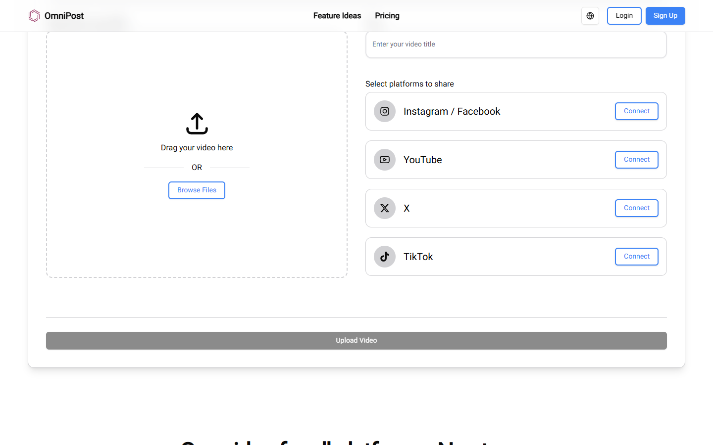
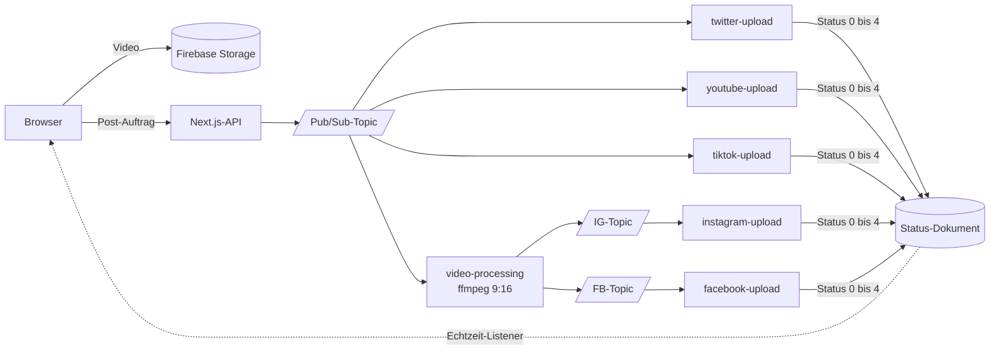
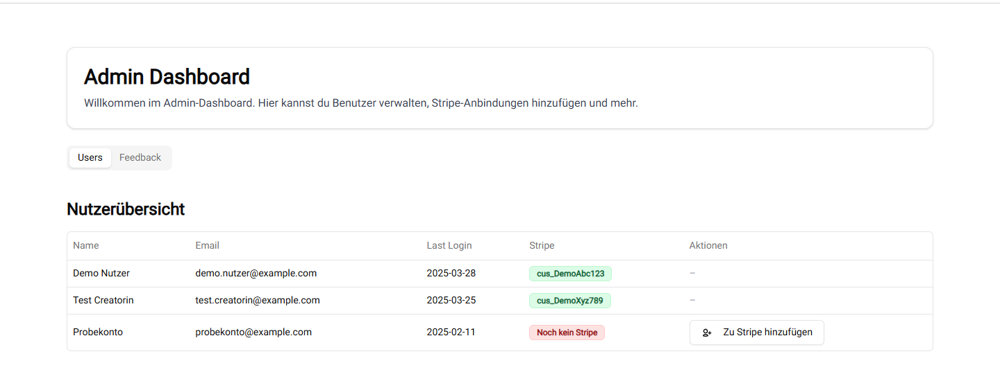
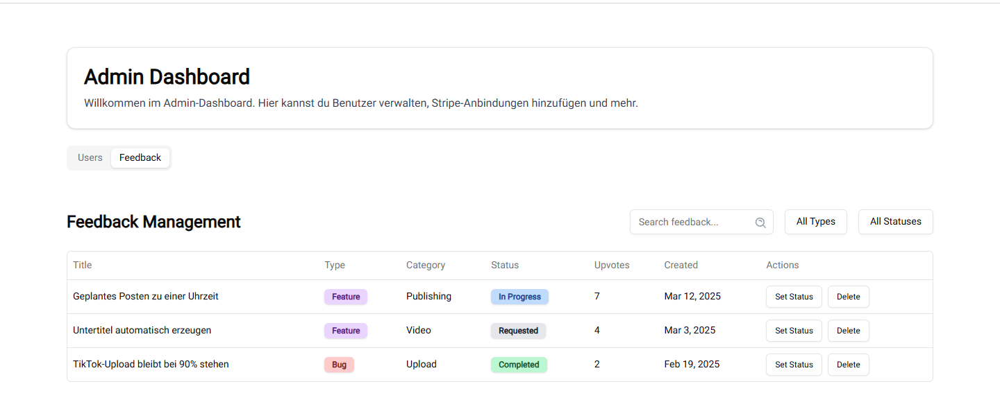

# omni-post

Ein Video hochladen, an fünf Plattformen verteilen: X/Twitter, Instagram,
TikTok, YouTube und Facebook. Ein Upload, ein Klick, fünf Veröffentlichungen.

## Das Problem

Wer regelmäßig kurze Videos veröffentlicht, lädt dieselbe Datei fünfmal hoch,
in fünf Oberflächen, mit fünf Anmeldungen, in fünf Formaten. Der Aufwand
wächst mit jeder Plattform, der Nutzen nicht. omni-post nimmt das Video einmal
entgegen und erledigt den Rest. Gedacht war es als bezahltes Produkt, echte
Nutzer oder Zahler gab es aber nie.

## Wie ein Post abläuft

Der Nutzer verbindet einmalig seine Konten (die vier OAuth-Flüsse dazu weiter
unten), zieht dann ein Video ins Upload-Feld, vergibt einen Titel und wählt
die Plattformen ab oder an. Wenn TikTok dabei ist, kommt ein verpflichtendes
Formular für Privatsphäre-Stufe und Branded-Content-Angaben dazu, das
verlangt die Plattform so.

Beim Absenden lädt der Browser die Datei direkt nach Firebase Storage. Die
Next.js-App prüft Sitzung und Abo, legt ein Status-Dokument an und
veröffentlicht eine einzige Nachricht auf ein Pub/Sub-Topic. Ab hier arbeiten
die Zweige unabhängig: X/Twitter, YouTube und TikTok haben je eine eigene
Cloud Function direkt am Topic. Instagram und Facebook laufen zweistufig,
denn die Graph-API ist wählerisch beim Format: Eine Verarbeitungs-Function
normalisiert das Video erst mit ffmpeg auf 9:16 in 1080 mal 1920 und
publiziert dann auf zwei eigene Topics, an denen die beiden Upload-Functions
hängen.

Jede Function schreibt ihren Fortschritt in das Status-Dokument, und das
Frontend hat darauf einen Firestore-Echtzeit-Listener: In der Karte mit den
letzten Videos steht pro Plattform ein Status von „gestartet" über
„verarbeitet" und „lädt hoch" bis „fertig" oder „fehlgeschlagen".
Nachrichten, die endgültig scheitern, fängt eine Dead-Letter-Function und
schreibt sie für die Fehlersuche nach Firestore.

## Warum die Verteilung so geschnitten ist

Plattform-APIs fallen aus, drosseln und ändern ihre Bedingungen unabhängig
voneinander. Ein gemeinsamer synchroner Aufruf hätte bedeutet, dass ein
hängendes TikTok den Instagram-Upload mitblockiert. Mit dem Fan-out über
Pub/Sub scheitert im schlechtesten Fall ein Zweig, und die übrigen laufen
durch.

**13 Cloud Functions** in Python teilen sich die Arbeit: fünf
Plattform-Uploads, die ffmpeg-Verarbeitung, die Dead-Letter-Funktion, ein
Aufräumjob für alte Videos im Storage, und fünf kleinere Funktionen für
Statusanlage, Nutzerdaten, Konto-Trennung samt Token-Invalidierung und die
TikTok-Creator-Daten. Die internen HTTP-Funktionen sind über ein gemeinsames
Geheimnis abgesichert, das nur die Next.js-App kennt.

## Die eigentliche Arbeit: fünf verschiedene Authentifizierungen

Jede Plattform macht es anders, und genau da steckt die Zeit:

- **X/Twitter** verlangt OAuth 1.0a mit Signatur pro Anfrage. Es gibt kein
  dauerhaftes Bearer-Token, stattdessen wird jede einzelne Anfrage mit einem
  HMAC über Methode, URL und sortierte Parameter signiert.
- **YouTube** läuft über OAuth 2.0, die Zugangs-Token laufen ab und werden
  mit einem Refresh-Token erneuert.
- **TikTok** hat einen eigenen Fluss samt separatem Endpunkt für
  Creator-Daten. Vor jedem Upload muss abgefragt werden, welche
  Privatsphäre-Stufen und welche maximale Videolänge das Konto erlaubt,
  TikTok nimmt Posts sonst nicht an.
- **Instagram und Facebook** hängen an der Graph-API mit Langzeit-Token.

Die Nutzer-Token liegen verschlüsselt in Firestore, der Schlüssel dafür im
Google Secret Manager. Die Zugangsdaten der Anwendungen kommen aus
Umgebungsvariablen, die erwarteten Namen stehen in `.env.example` (Next.js)
und `cloud_functions/.env.example` (Functions).

## Bezahlung und Feedback

Posten war als Premium-Funktion gebaut: 9,99 € im Monat mit 30 Tagen
Testphase, unbegrenzten Uploads und ohne Wasserzeichen. Die Server-Seite
prüft vor jedem Post ein aktives Stripe-Abo, abgewickelt über die
Firestore-Stripe-Erweiterung samt Kundenportal.

Dazu gibt es eine eigene Seite für Feature-Wünsche und Fehlermeldungen:
Nutzer reichen Vorschläge mit Titel, Kategorie und Beschreibung ein und
voten die Ideen anderer hoch. Anonym sichtbar sind Startseite mit
Upload-Tool, Preisseite und die Rechtstexte.

## Der Admin-Bereich

Der Admin-Bereich gehört genau einem Konto, dessen ID über eine
Umgebungsvariable gesetzt wird, eine Rechteverwaltung gibt es bewusst
nicht. Er hat zwei Reiter: die Nutzerübersicht mit Name, E-Mail, letztem
Login und Stripe-Status, aus der sich ein Stripe-Kunde direkt anlegen
lässt, und das Feedback-Management, in dem die eingereichten Wünsche und
Fehlermeldungen gefiltert, durchsucht, im Status weitergeschoben
(angefragt, in Arbeit, fertig) und gelöscht werden.

## Stack

Next.js 15 mit React und TypeScript, Tailwind, Firebase und Firebase Admin
für Auth, Firestore und Storage, Google Cloud Pub/Sub für die Verteilung,
13 Cloud Functions in Python, ffmpeg für die Videoverarbeitung, Stripe über
die Firestore-Stripe-Erweiterung.

## Zu diesem Repository

**Nicht mehr in Betrieb.** Die Cloud-Infrastruktur wurde 2026 abgebaut, das
Firebase-Projekt ist gelöscht, die OAuth-Zugänge der Plattformen sind
abgelaufen. Der Code ist vollständig, die Verteilung läuft aber nirgends
mehr. Die Screenshots stammen aus der lokal gestarteten Oberfläche dieser
Veröffentlichung, und weil das Backend fehlt, sind alle Nutzer- und
Feedback-Daten darin nachgestellte Beispieldaten.

## Lizenz

Alle Rechte vorbehalten. Dieses Repository dient als Arbeitsprobe,
Nachnutzung nur nach Absprache.
